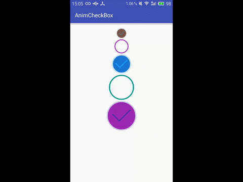

# AnimCheckBox

##Screenshot


###Inspired  By [Dribbble](https://dribbble.com/shots/1631598-On-Off)

##Import to your project
###Gradle
Add it in your build.gradle at the end of repositories
```
repositories {
    // ...
    maven { url "https://jitpack.io" }
}
```
Add the dependency in the form
```groovy
dependencies {
    compile 'com.github.lguipeng:AnimCheckBox:1.0.1'
}
```
###Maven
```
<repository>
    <id>jitpack.io</id>
    <url>https://jitpack.io</url>
</repository>
```
```
<dependency>
    <groupId>com.github.lguipeng</groupId>
    <artifactId>AnimCheckBox</artifactId>
    <version>1.0.1</version>
</dependency>
```
###Or
Copy [`AnimCheckBox.java`](./library/src/main/java/com/github/lguipeng/library/animcheckbox/AnimCheckBox.java) into your project.


##Usage
###In Layout File
```
  <com.github.lguipeng.library.animcheckbox.AnimCheckBox
        android:layout_gravity="center_horizontal"
        android:layout_width="80dp"
        android:padding="4dp"
        android:layout_height="wrap_content"
        app:stroke_width="4dp"
        app:stroke_color="#2196F3"
        app:circle_color="#1976D2"
        app:checked="true"/>
```
###In Java File
```
AnimCheckBox checkbox = (AnimCheckBox)findViewById(R.id.checkbox)
checkbox.setChecked(true);
boolean animation = true;
checkbox.setChecked(false, animation);
```

##关于我
- Email: lgpszu@163.com

##License
```
Copyright 2017 Liaoguipeng

Licensed under the Apache License, Version 2.0 (the "License");
you may not use this file except in compliance with the License.
You may obtain a copy of the License at

    http://www.apache.org/licenses/LICENSE-2.0

Unless required by applicable law or agreed to in writing, software
distributed under the License is distributed on an "AS IS" BASIS,
WITHOUT WARRANTIES OR CONDITIONS OF ANY KIND, either express or implied.
See the License for the specific language governing permissions and
limitations under the License.
```


